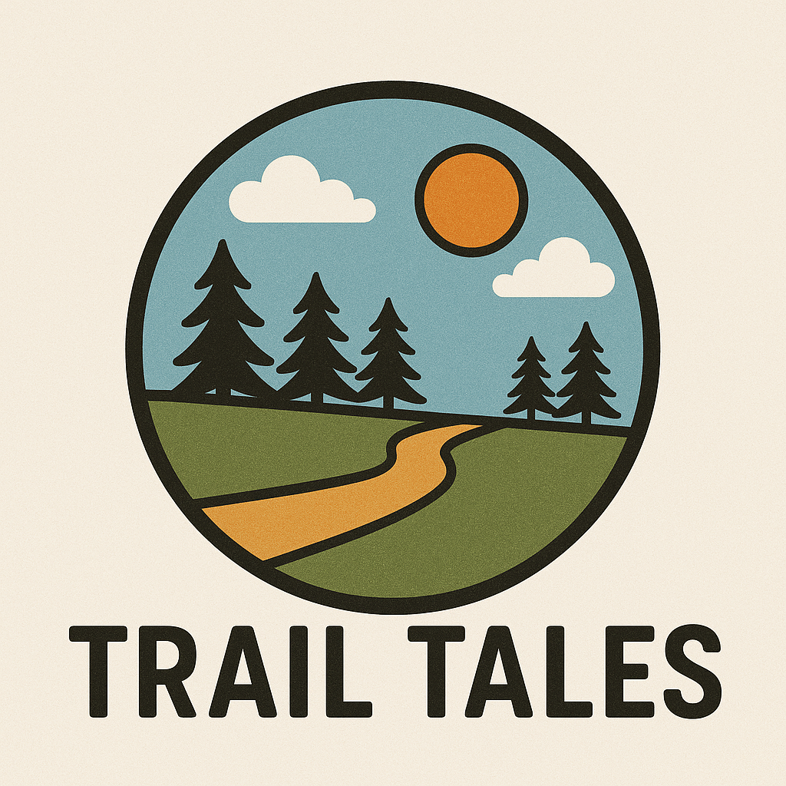

# Trail-Tales
## **Screenshot/Logo**: A screenshot of your app or a logo.

> **Logo:** Created by Peri Carney using AI-assisted design (OpenAI DALL·E).

## Trail Tales: Include a description of your app and what it does. Background info about the game and why you chose it is a nice touch.

I created Trail Tales because of my hobby of biking! I have been biking more and learning more about gear,common practices, trails, my community, and fitness goals. I wanted a way to document my bike rides by statistical information to track my progress and in a blog setting so I could utilize the pictures I took and share stories from my rides on the trails.

## **Getting started**: Include a link to your deployed app and any instructions you deem important. This should also contain a link to your planning materials.

- [Trello Planning Materials](https://trello.com/b/fVasRC3J/project-2-bike-tracking-app)
- [Trail Tales Deployed](https://trailtales-9edd5f26ccd2.herokuapp.com/)

## **Attributions**: This section should include links to any external resources (such as libraries or assets) you used to develop your application that require attribution. You can exclude this section if it does not apply to your application.
- Logo: Created by Peri Carney using AI-assisted design (OpenAI DALL·E).
- [Moment](https://momentjs.com/)
- [Pico](https://picocss.com/)
-[Google Fonts](https://fonts.google.com/specimen/Fuzzy+Bubbles)
## **Technologies used**: List of the technologies used, for example: JavaScript, HTML, CSS, etc.

Next Steps: Planned Future Enhancements (stretch goals).

Tech used includes:
- EJS
- JavaScript
- CSS
- [Pico](https://picocss.com/)
-[Google Fonts](https://fonts.google.com/specimen/Fuzzy+Bubbles)

Future Goals:
- blogs: They will have a many to many relationship with the rides. This will also be used to grow the community aspect of the app. Eventually I want people to positively interact and engae with each other.
- - I want users to have the option to share their entries publicly or keep them private.
- Ride Stats: setting/ visualizing goals for fitness.
- Goals & bages: Engagement.